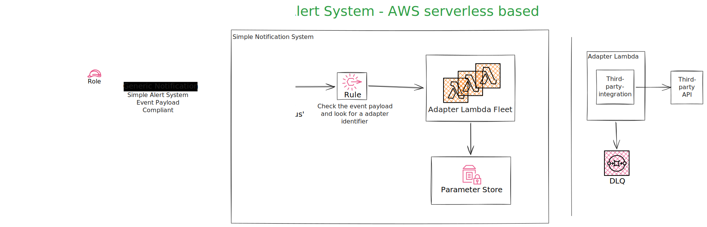

# Simple Alert Service
This is a project to simplify the alerts and notifications for nonprod and prod enviroments for personal projects. It is serverless architecture based. Each integration compatibility can be added via lambdas.

## Component and Connector Diagram
The following C&C Diagram summarizes the project high level architecture.

## Compatibility 
Integrations completed for
- TBD

## More information
TBD

## License
TBD
